# System Architecture Algorithms Documentation

## Overview

This document explains the core algorithms used in the System Architect Sandbox. The system analyzes software architecture designs through four main algorithms: cost estimation, performance simulation, simulation validation, and design validation.

---

## 1. Cost Estimation Algorithm

### Purpose
Calculate monthly infrastructure costs based on component types and their configuration properties.

### Algorithm Flow

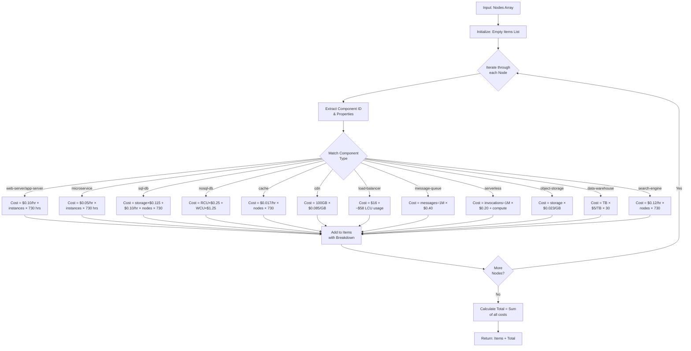

### Cost Calculation Table

| Component | Formula | Example |
|-----------|---------|---------|
| Web/App Server | `$0.10/hr × instances × 730 hrs` | 2 instances = $146/mo |
| Microservice | `$0.05/hr × instances × 730 hrs` | 3 instances = $109.50/mo |
| SQL Database | `storage×$0.115 + $0.10/hr × (1+replicas)×730` | 100GB, 1 replica = $84.50/mo |
| NoSQL Database | `RCU×$0.25 + WCU×$1.25` | 100 RCU, 50 WCU = $87.50/mo |
| Cache | `$0.017/hr × nodes × 730` | 3 nodes = $37.23/mo |
| Message Queue | `(throughput×3600×730÷1M)×$0.40` | 10k msg/sec = ~$105/mo |
| Serverless | `(invocations÷1M)×$0.20 + compute` | 1M mo invocations = $200+ |

### Key Properties

- **Time Unit**: Monthly (730 hours)
- **Pricing Model**: Pay-as-you-go with per-unit costs
- **Accuracy**: Approximate; based on average configurations

---

## 2. Simulation Algorithm

### Purpose
Analyze performance characteristics: latency (p50/p95/p99), throughput, bottlenecks, availability, and redundancy.

### Main Algorithm Flow

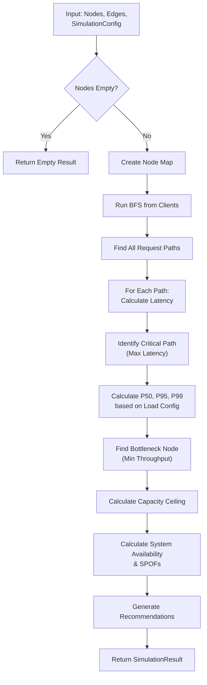

### BFS Client Traversal Algorithm

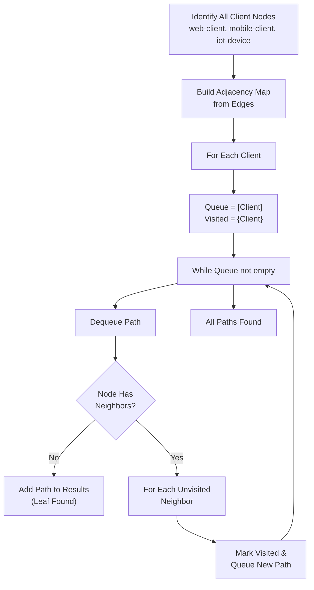

### Critical Path & Latency Calculation

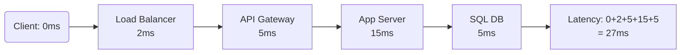

### Throughput Bottleneck Detection

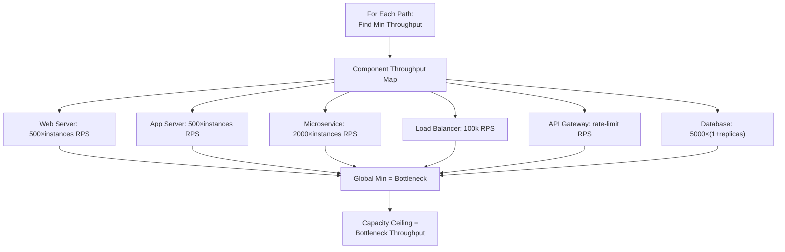

### Availability & SPOF Calculation

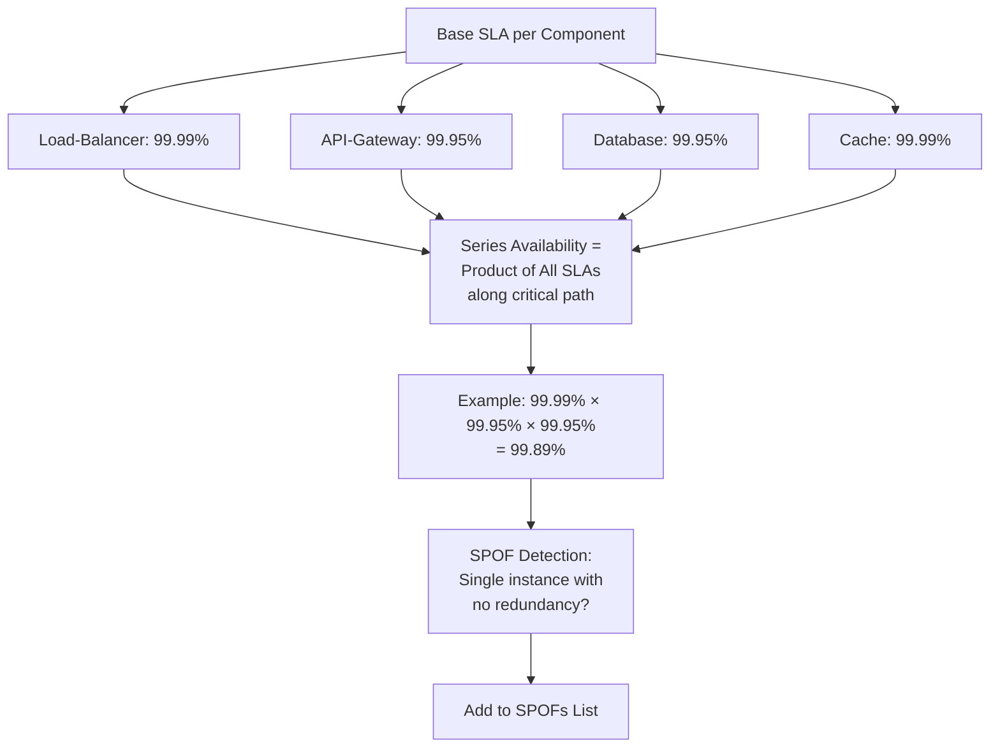

### Performance Metrics Calculation

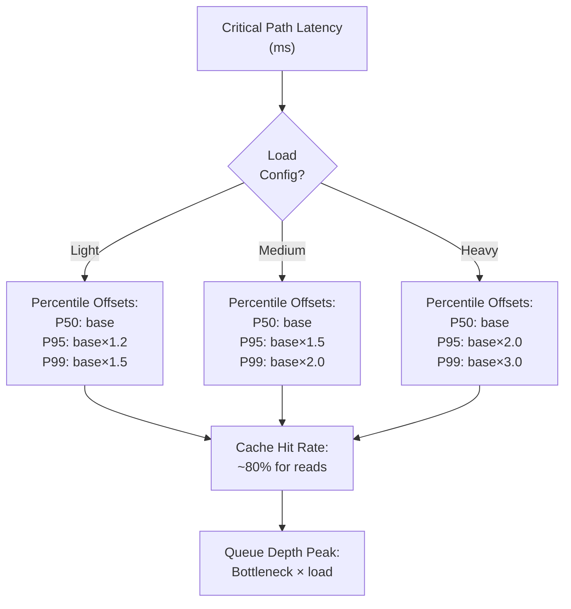

---

## 3. Simulation Validation Algorithm

### Purpose
Validates that an architecture is valid for simulation, enforcing hard rules and soft warnings.

### Validation Rules & Decision Tree

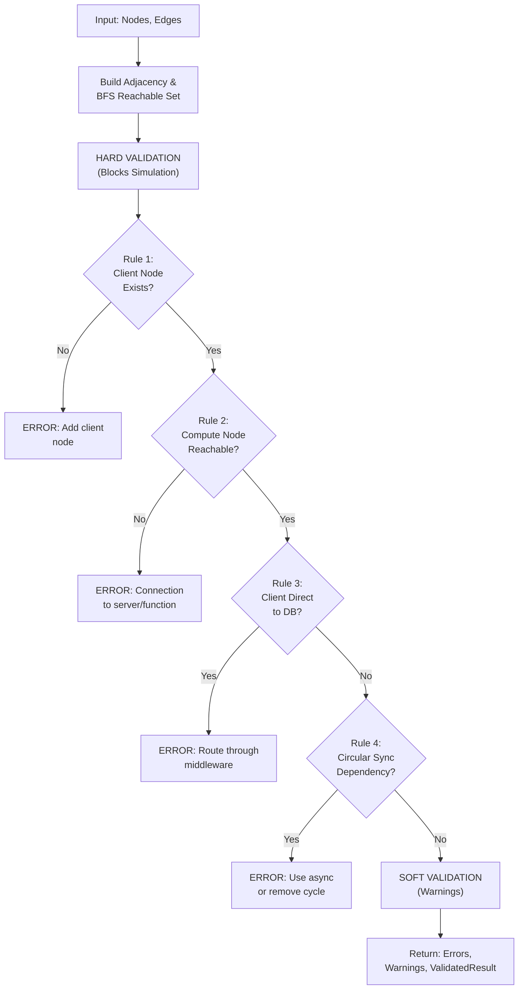

### Circular Dependency Detection (DFS)

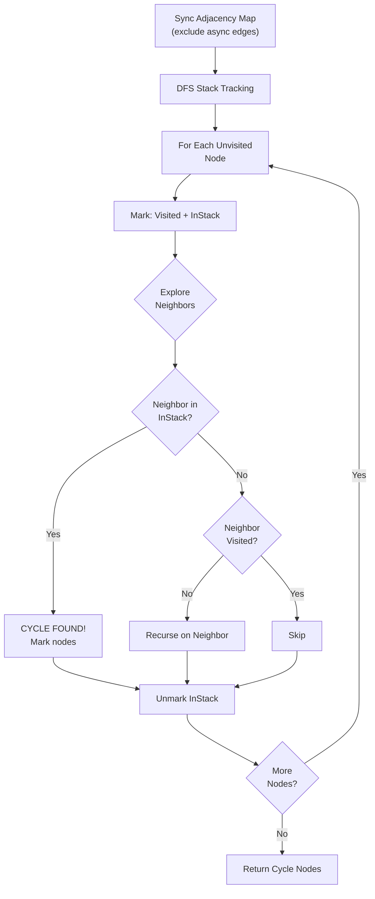

### BFS Reachability Analysis

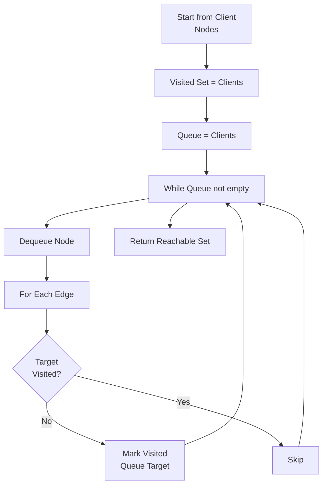

---

## 4. Design Validation Algorithm

### Purpose
Validate architecture design patterns and identify anti-patterns before simulation.

### Validation Rules

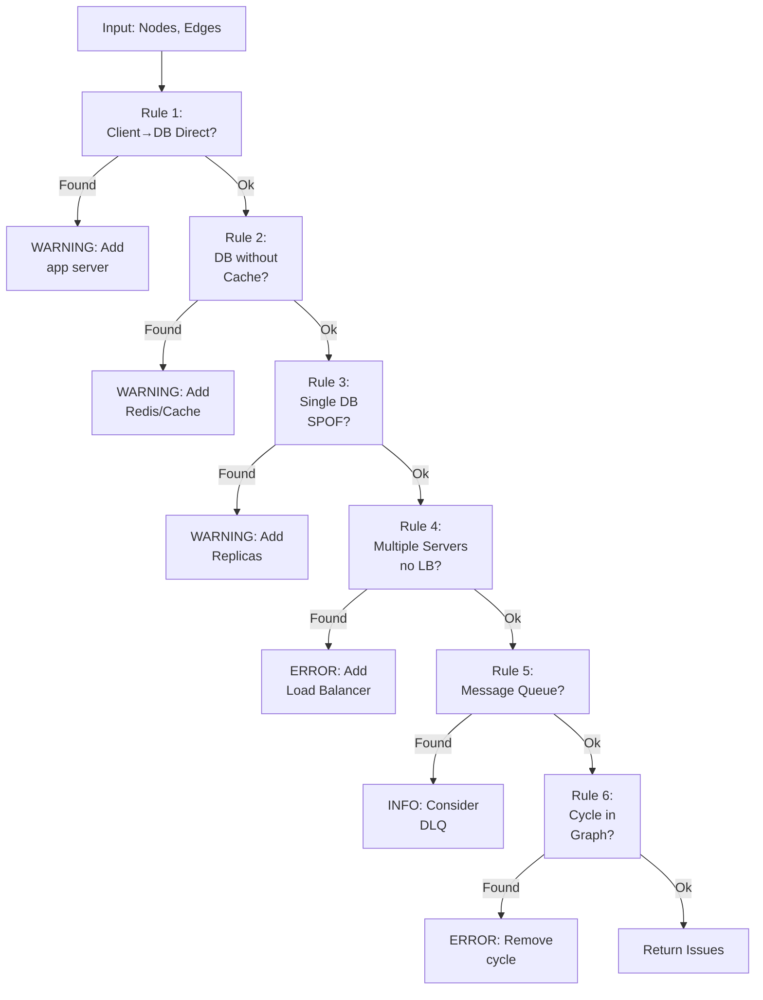

### Cycle Detection Algorithm (DFS)

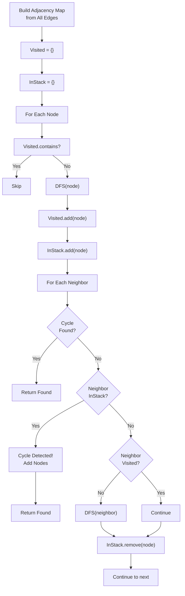

---

## Data Flow Diagram: Complete Analysis Pipeline

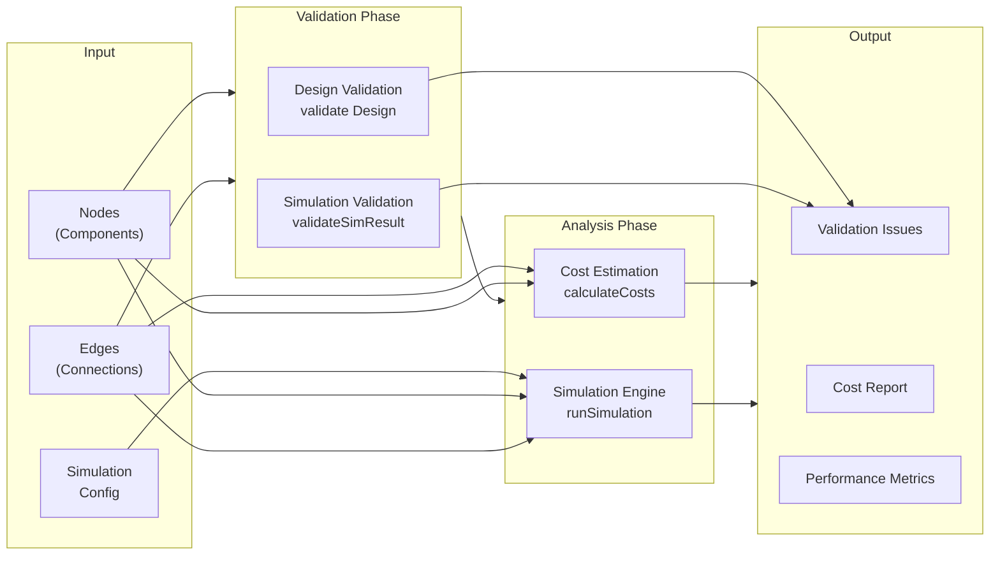

---

## Algorithm Complexity Analysis

| Algorithm | Time Complexity | Space Complexity | Notes |
|-----------|-----------------|------------------|-------|
| Cost Estimation | O(n) | O(n) | n = number of nodes |
| BFS Path Finding | O(n + e) | O(n + e) | n = nodes, e = edges |
| Critical Path | O(p × n) | O(n) | p = number of paths |
| Bottleneck Find | O(p × n) | O(n) | Iterates all paths |
| Cycle Detection (DFS) | O(n + e) | O(n) | Graph DFS standard |
| Reachability (BFS) | O(n + e) | O(n) | Graph BFS standard |
| Hard Validation | O(n + e) | O(n) | Multiple passes through graph |
| Design Validation | O(n + e) | O(n) | DFS + feature checks |

---

## Key Design Patterns

### 1. **Map-Reduce Pattern for Costs**
```
Map: Each node → its cost calculation
Reduce: Sum all costs into total
```

### 2. **Graph Traversal Pattern**
```
Three main graph algorithms:
- BFS: Find all client paths
- DFS: Cycle detection
- Topological-aware: For availability calculation
```

### 3. **Validation Pipeline Pattern**
```
Hard Validation (fails immediately)
    ↓
Soft Validation (collects warnings)
    ↓
Simulation if all hard rules pass
    ↓
Return full result with issue context
```

### 4. **Aggregation Pattern for Metrics**
```
Per-path calculations
    ↓
Aggregate across all paths
    ↓
Extract critical/bottleneck values
    ↓
Calculate system-wide metrics
```

---

## Example: End-to-End Analysis

### Architecture
```
Client (web-browser)
  ↓
Load Balancer (1)
  ↓
API Gateway (1)
  ↓
App Server (2 instances)
  ↓
SQL Database (1 primary)
```

### Cost Estimation Result
- App Servers: $0.10/hr × 2 × 730 = **$146**
- Load Balancer: $16 + ~$58 = **$74**
- API Gateway: ~$50
- SQL DB: ~$85
- **Total: ~$355/month**

### Simulation Result
- **P50 Latency**: 27ms (client→LB→API→App→DB)
- **P95 Latency**: ~32ms (27 × 1.2)
- **P99 Latency**: ~40ms (27 × 1.5)
- **Throughput Ceiling**: Limited by App Server (~1000 RPS × 2 = 2000 RPS)
- **Availability**: 99.99% × 99.95% × 99.95% × 99.9% ≈ **99.78%**

### Validation Warnings
- No caching layer for read-heavy workload
- Database has no replicas (single point of failure)
- Consider auto-scaling for traffic spikes

---

## Implementation Notes

### Libraries Used
- **ReactFlow**: Graph/node management
- **TypeScript**: Type safety for components and edges

### Extensibility Points
1. **New Component Types**: Add to cost formulas and latency maps
2. **Custom Validation Rules**: Extend hard/soft validation functions
3. **Load Profiles**: Modify percentile calculations for different load scenarios
4. **Pricing Models**: Update cost formulas for different cloud providers

---

## References

- **P50/P95/P99**: Percentiles of latency distribution
- **Bottleneck**: Component with lowest throughput on critical path
- **SPOF**: Single Point of Failure - component with no redundancy
- **Critical Path**: Longest latency path from client to backend
- **SLA**: Service Level Agreement - uptime guarantee
